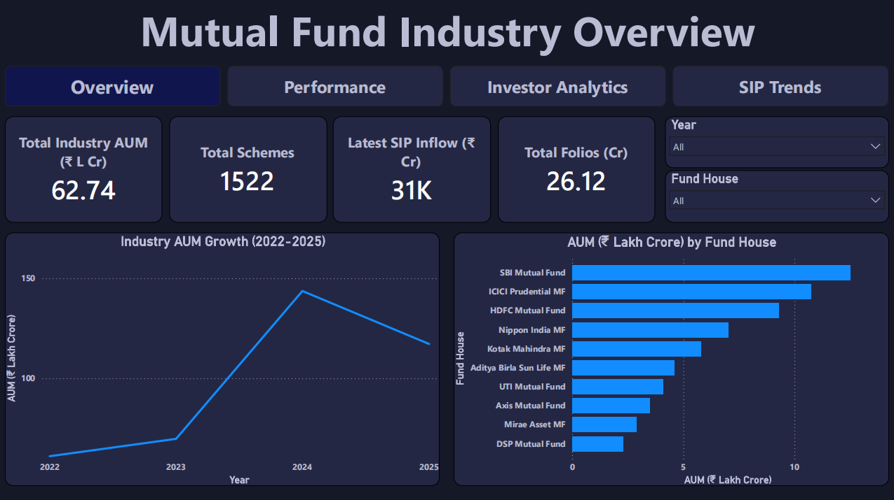
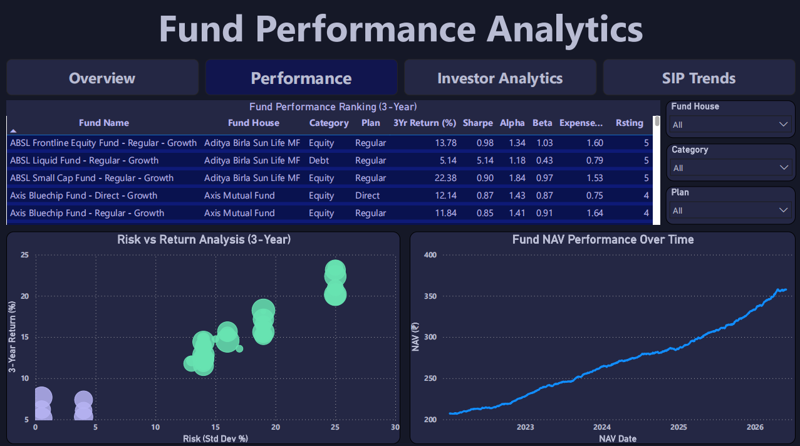
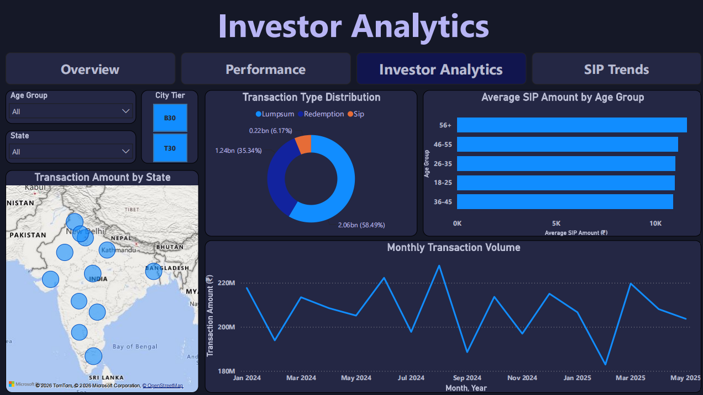
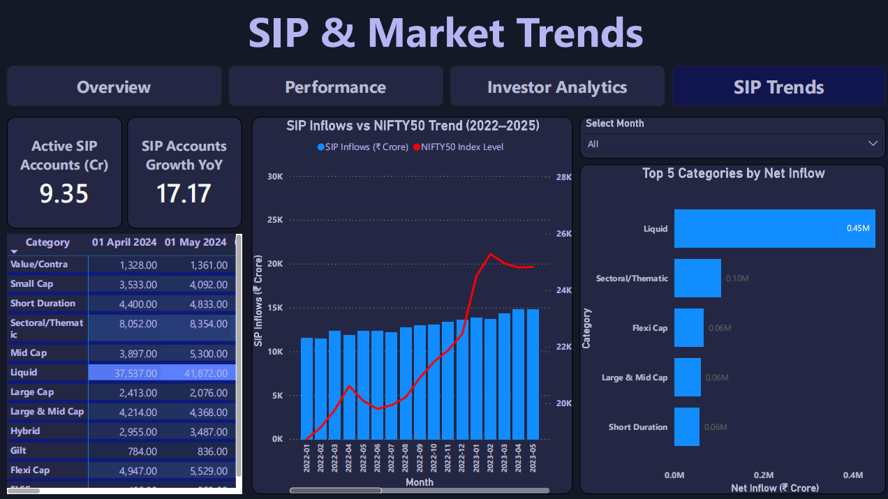

# Bluestock Mutual Fund Analytics Platform

## Overview

The Bluestock Mutual Fund Analytics Platform is an end-to-end data analytics and business intelligence project designed to analyze mutual fund performance, investor behavior, portfolio risk, and SIP growth trends in the Indian mutual fund industry.

The project combines Python-based ETL pipelines, PostgreSQL data warehousing, advanced financial analytics, and interactive Power BI dashboards to generate actionable insights for investors, analysts, and fund managers.

---

## Project Objectives

- Build a complete mutual fund analytics pipeline from raw data ingestion to business intelligence reporting.
- Analyze mutual fund performance using financial risk-adjusted metrics.
- Study SIP growth trends and investor behavior patterns.
- Perform portfolio and sector concentration analysis.
- Compare fund performance against benchmark indices.
- Develop a rule-based mutual fund recommendation engine.
- Create an interactive Power BI dashboard for business users.

---

## Tech Stack

### Programming & Analytics

- Python
- Pandas
- NumPy
- Matplotlib
- Seaborn

### Database

- PostgreSQL
- SQLAlchemy
- SQL

### Business Intelligence

- Power BI

### Development Tools

- VS Code
- Git
- GitHub

---

## Project Architecture

```text
Raw Data
    ↓
Data Ingestion
    ↓
Data Profiling
    ↓
Data Cleaning & Transformation
    ↓
PostgreSQL Data Warehouse
    ↓
Advanced Analytics
    ↓
Power BI Dashboard
    ↓
Business Insights & Reporting
```

---

## Key Features

### Data Engineering

- Data ingestion pipeline
- Data validation and profiling
- Data cleaning and transformation
- PostgreSQL integration
- Automated ETL workflow

### Financial Analytics

- CAGR Analysis
- Alpha & Beta Analysis
- Sharpe Ratio Analysis
- Sortino Ratio Analysis
- Maximum Drawdown Analysis
- Value at Risk (VaR)
- Conditional Value at Risk (CVaR)

### Investor Analytics

- Investor Cohort Analysis
- SIP Continuity Analysis
- Transaction Behavior Analysis

### Portfolio Analytics

- Sector Concentration Analysis
- Portfolio Holdings Analysis
- Diversification Assessment

### Recommendation System

- Risk-Based Fund Recommendation Engine
- Sharpe Ratio Based Ranking

### Business Intelligence

- Interactive Power BI Dashboard
- KPI Tracking
- Performance Monitoring
- Investor Analytics
- SIP Trend Analysis

---

## Dashboard Preview

### Overview Dashboard



### Performance Dashboard



### Investor Analytics Dashboard



### SIP Trends Dashboard



---

## Dashboard Pages

### 1. Overview

- Active SIP Accounts KPI
- SIP Accounts Growth KPI
- Industry AUM Analysis
- Fund House Comparison
- Mutual Fund Industry Overview

### 2. Performance

- Risk-Adjusted Performance Metrics
- Fund Performance Comparison
- Alpha-Beta Analysis
- Sharpe Ratio Analysis
- Risk Analytics

### 3. Investor Analytics

- Investor Demographics
- Cohort Analysis
- SIP Continuity Analysis
- Transaction Trends
- Investor Segmentation

### 4. SIP Trends

- Monthly SIP Growth
- NIFTY50 Comparison
- Category-Wise Inflows
- Market Trend Analysis

---

## Advanced Analytics Implemented

### Risk Analytics

- Value at Risk (VaR 95%)
- Conditional Value at Risk (CVaR 95%)
- Rolling Sharpe Ratio Analysis
- Maximum Drawdown Analysis

### Investor Analytics

- Cohort Analysis
- SIP Continuity Tracking
- Investor Retention Analysis

### Performance Analytics

- CAGR Computation
- Alpha Calculation
- Beta Calculation
- Sharpe Ratio Ranking
- Sortino Ratio Ranking

### Portfolio Analytics

- Sector Concentration Analysis
- Diversification Assessment
- Portfolio Holdings Analysis

---

## Project Structure

```text
BLUESTOCK_MF_CAPSTONE
│
├── dashboard
│   ├── screenshots
│   ├── bluestock_mf_dashboard.pbix
│   └── bluestock_mf_dashboard.pdf
│
├── data
│   ├── raw
│   ├── processed
│   └── db
│
├── docs
│   └── data_dictionary.md
│
├── notebooks
│   ├── 01_data_ingestion.ipynb
│   ├── eda_analysis.ipynb
│   ├── Performance_analytics.ipynb
│   └── Advanced_Analytics.ipynb
│
├── reports
│   ├── analytics
│   ├── charts
│   ├── Bluestock_MF_Presentation.pptx
│   └── Final_Report.pdf
│
├── scripts
│   ├── config.py
│   ├── data_ingestion.py
│   ├── data_profiling.py
│   ├── live_nav_fetch.py
│   ├── load_to_postgres.py
│   ├── recommender.py
│   ├── test_connection.py
│   └── run_pipeline.py
│
├── sql
│   ├── schema.sql
│   └── queries.sql
│
├── README.md
└── requirements.txt
```

---

## Deliverables

### Documentation

- Final Project Report (PDF)
- Project Presentation (PPTX)
- Data Dictionary

### Analytics

- Risk Analytics Reports
- Performance Reports
- Cohort Analysis
- SIP Continuity Analysis
- Portfolio Analysis

### Dashboard

- Power BI Dashboard (.pbix)
- Dashboard PDF Export

### Database

- PostgreSQL Schema
- SQL Queries

---

## Key Insights

- SIP inflows showed strong growth throughout the analysis period.
- SBI Mutual Fund maintained the highest Assets Under Management (AUM).
- Liquid Funds consistently attracted the highest net inflows across categories.
- Several actively managed funds outperformed benchmark indices on a risk-adjusted basis.
- Investor retention patterns highlighted opportunities for improving SIP continuity.
- Portfolio concentration analysis revealed varying diversification levels across funds.

---

## Future Enhancements

- Real-time NAV integration
- Machine Learning based recommendation engine
- Portfolio optimization models
- Market sentiment analysis
- Automated dashboard refresh pipeline
- Cloud deployment using AWS or Azure

---

## Author

**Aditya Yadav**

Data Analytics | Python | SQL | PostgreSQL | Power BI

GitHub: https://github.com/adityaayadavv

---

## License

This project is developed for educational and portfolio purposes.